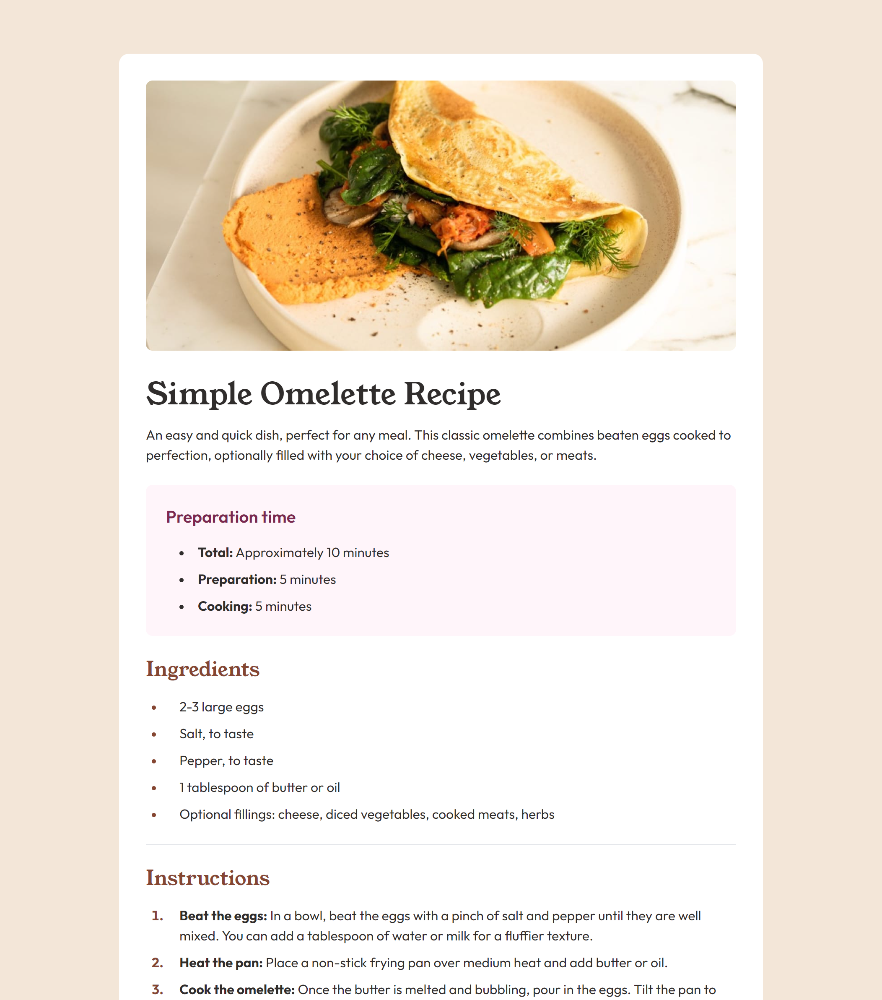

# Frontend Mentor - Recipe page solution

This is a solution to the [Recipe page challenge on Frontend Mentor](https://www.frontendmentor.io/challenges/recipe-page-KiTsR8QQKm). Frontend Mentor challenges help you improve your coding skills by building realistic projects. 

## Table of contents

- [Overview](#overview)
  - [The challenge](#the-challenge)
  - [Screenshot](#screenshot)
  - [Links](#links)
- [My process](#my-process)
  - [Built with](#built-with)
  - [What I learned](#what-i-learned)
  - [Continued development](#continued-development)
  - [Useful resources](#useful-resources)
- [Author](#author)
- [Acknowledgments](#acknowledgments)

## Overview

### The Challenge

My challenge was to build out a recipe page and get it looking as close to the design as possible. I wanted to continue practicing TailwindCSS

### Screenshot



### Links

- Solution URL: [https://github.com/robbiedob21/recipe-page-main](https://github.com/robbiedob21/recipe-page-main)
- Live Site URL: [robbiedob21-recipe.netlify.app/](robbiedob21-recipe.netlify.app/)

## My process

### Built with

- HTML
- Tailwind CSS

### What I learned

I learned how to use the tailwind.config.js file to extend font families, as well as import local fonts into a project using @font-face

```js
fontFamily: {
  serif: ["young-serif", "georgia"],
  sans: ["outfit", "verdana"],
}
```

``` css
@font-face {
        font-family: 'young-serif';
        font-style: normal;
        src: url('../assets/fonts/young-serif/YoungSerif-Regular.ttf') format('truetype');
    }
```

### Continued development

I found that I need to continue learning the psuedo code in Tailwind CSS to increase the possiblities in my creations.

### Useful resources

- [Everything You Need to Know About the Gap After the List Marker](https://css-tricks.com/everything-you-need-to-know-about-the-gap-after-the-list-marker/) - This helped me with formatting the list items to be how I wanted.
- [Why isn't Tailwind applying styles to my HTML?](https://stackoverflow.com/questions/70746851/why-isnt-tailwind-applying-styles-to-my-html) - This taught me about needing to run the build command while working with Tailwind CLI

## Author

- Website - [Robbie](https://www.robbie.kiwi)
- Frontend Mentor - [@robbiedob21](https://www.frontendmentor.io/profile/robbiedob21)

## Acknowledgments

Thanks to the Front End Mentor team for another great project to add to my portfolio

